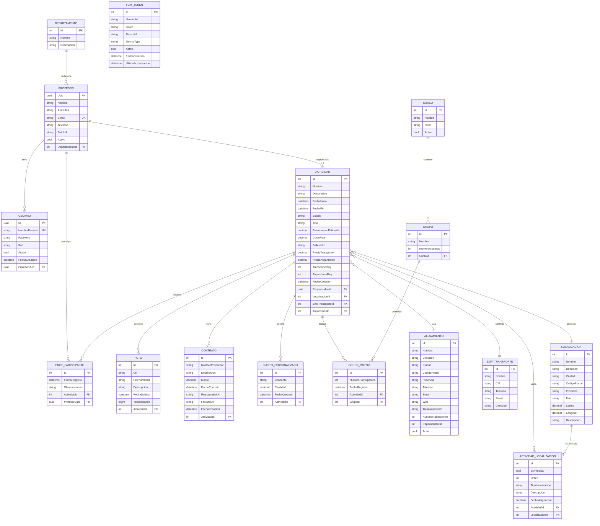
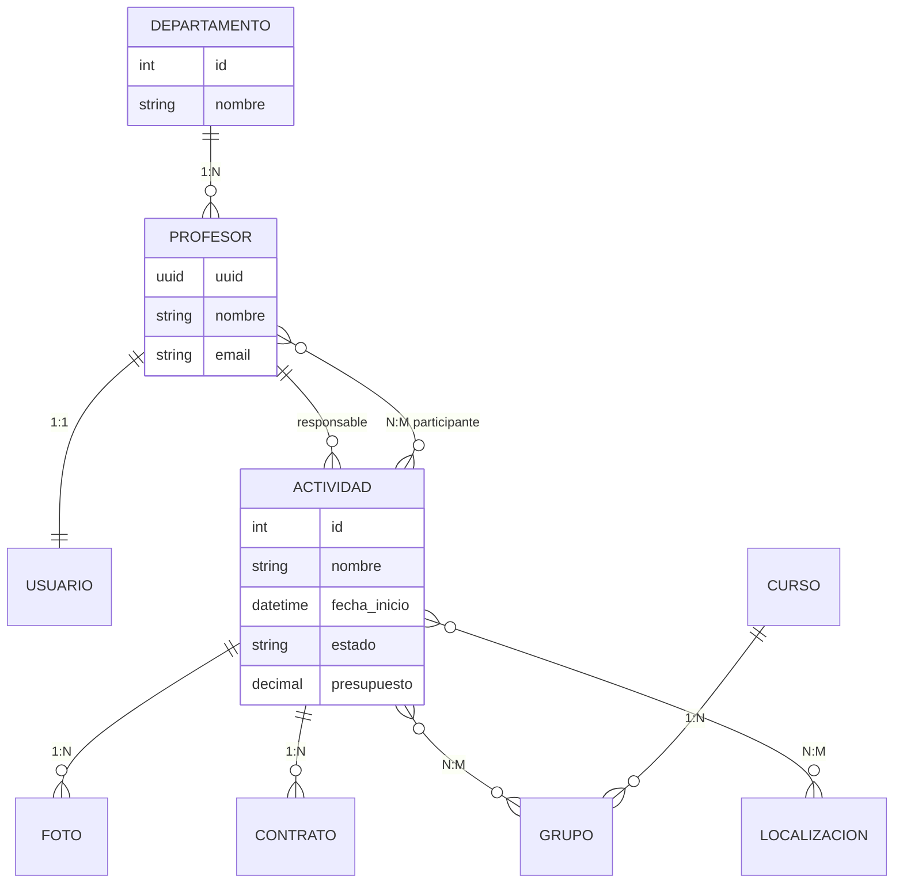

# Diagrama E/R Sistema ACEX - Código Mermaid

## Instrucciones
1. Copia el código de abajo
2. Ve a: https://mermaid.live/
3. Pega el código en el editor
4. Exporta como PNG o SVG

## Código Mermaid

## Alternativa: Versión Simplificada (más legible)

