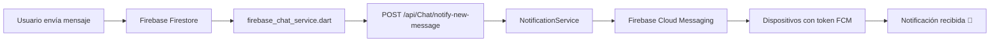

# ✅ Sistema de Notificaciones - Estado Final

## 🎉 TODO COMPLETADO Y FUNCIONANDO

### ✅ **Backend (C#)**
- [x] Tabla `FcmTokens` creada en la base de datos
- [x] `NotificationService` implementado y registrado
- [x] `NotificationController` con endpoints para registro de tokens
- [x] `ChatController` con endpoint para notificar mensajes
- [x] Paquete `FirebaseAdmin` instalado
- [x] Compilación exitosa

### ✅ **Frontend (Flutter)**
- [x] `notification_service.dart` creado y configurado
- [x] `firebase_chat_service.dart` actualizado para enviar notificaciones
- [x] Integrado en el flujo de login (registra token automáticamente)
- [x] Integrado en el flujo de logout (elimina tokens)
- [x] Paquete `flutter_local_notifications` instalado

## 🚀 SIGUIENTE PASO: Configurar Firebase Credentials

### **SOLO FALTA ESTE PASO PARA QUE FUNCIONE:**

1. **Ir a Firebase Console**: https://console.firebase.google.com
2. **Seleccionar proyecto**: acexchat
3. **Configuración del proyecto** (⚙️) > **Cuentas de servicio**
4. **Click**: "Generar nueva clave privada"
5. **Descargar** el archivo JSON
6. **Guardar como**: `ACEXAPI/firebase-credentials.json`
7. **Añadir a `.gitignore`**:
   ```gitignore
   firebase-credentials.json
   ```
8. **Reiniciar backend**: `dotnet run`
9. **Verificar en logs**: "Firebase Admin SDK initialized successfully"

## 🧪 PROBAR LAS NOTIFICACIONES

### **Opción 1: Prueba End-to-End (Recomendado)**

1. **Iniciar backend**:
   ```bash
   cd ACEXAPI
   dotnet run
   ```

2. **Iniciar app Flutter en dispositivo Android** (o emulador):
   ```bash
   cd proyecto_santi
   flutter run
   ```

3. **Iniciar sesión** con Usuario 1 (ej: `Santi`)
   - El token FCM se registra automáticamente

4. **Verificar token registrado**:
   ```sql
   SELECT * FROM FcmTokens WHERE Activo = 1;
   ```

5. **En otro dispositivo/emulador**, iniciar sesión con Usuario 2

6. **Abrir el chat** de una actividad donde estén ambos usuarios

7. **Usuario 1 envía mensaje** → Usuario 2 debe recibir notificación 🔔

### **Opción 2: Prueba Manual con Postman**

```http
POST http://localhost:5000/api/Notification/test
Authorization: Bearer {tu_jwt_token}
```

Esto envía una notificación de prueba al usuario autenticado.

### **Opción 3: Prueba del Endpoint de Chat**

```http
POST http://localhost:5000/api/Chat/notify-new-message
Authorization: Bearer {jwt_token}
Content-Type: application/json

{
  "actividadId": 1,
  "senderName": "Prueba",
  "messagePreview": "Hola, esto es una prueba"
}
```

## 📊 VERIFICAR QUE FUNCIONA

### **1. Verificar Token Registrado**
```sql
SELECT 
    u.NombreUsuario,
    t.Token,
    t.DeviceType,
    t.FechaCreacion,
    t.Activo
FROM FcmTokens t
JOIN Usuarios u ON t.UsuarioId = u.Id
WHERE t.Activo = 1;
```

### **2. Ver Logs Backend**
Busca estas líneas al iniciar:
```
Firebase Admin SDK initialized successfully
FCM token registered for user {uuid}
```

Al enviar mensaje:
```
[ChatService] Notification sent successfully
Notificaciones de chat enviadas para actividad {id} a {count} usuarios
```

### **3. Ver Logs Flutter**
```
[Notifications] FCM Token: {token}
[ChatService] Notification sent successfully
[Notifications] Foreground message received: Mensaje de {nombre}
```

## 📱 COMPORTAMIENTO ESPERADO

| Escenario | Resultado |
|-----------|-----------|
| App abierta | ✅ Notificación local aparece (flutter_local_notifications) |
| App en background | ✅ Notificación en barra del sistema |
| App cerrada | ✅ Notificación en barra del sistema |
| Usuario sin token | ⚠️ Log: "No active tokens found" |
| Firebase no configurado | ⚠️ Log: "Firebase not initialized" |

## 🐛 TROUBLESHOOTING RÁPIDO

### **"Firebase not initialized"**
→ Falta archivo `firebase-credentials.json` o está mal ubicado

### **"No active tokens found"**
→ Usuario no ha iniciado sesión desde móvil o token no se registró

### **"No JWT token available"**
→ Usuario no autenticado, hacer login nuevamente

### **Notificaciones no llegan**
1. Verificar Firebase credentials configuradas ✓
2. Verificar token en BD: `SELECT * FROM FcmTokens WHERE Activo = 1`
3. Verificar logs backend y Flutter
4. Verificar permisos de notificaciones en Android

## 📝 ARCHIVOS CREADOS/MODIFICADOS

### **Backend**
- ✅ `Controllers/ChatController.cs` (NUEVO)
- ✅ `Controllers/NotificationController.cs` (NUEVO)
- ✅ `Services/NotificationService.cs` (NUEVO)
- ✅ `Services/INotificationService.cs` (NUEVO)
- ✅ `Models/FcmToken.cs` (NUEVO)
- ✅ `DTOs/NotificationDto.cs` (NUEVO)
- ✅ `Data/ApplicationDbContext.cs` (MODIFICADO)

### **Frontend**
- ✅ `services/notification_service.dart` (NUEVO)
- ✅ `services/chat/firebase_chat_service.dart` (MODIFICADO)
- ✅ `models/auth.dart` (MODIFICADO)
- ✅ `main.dart` (MODIFICADO)
- ✅ `pubspec.yaml` (MODIFICADO)

### **Base de Datos**
- ✅ Tabla `FcmTokens` creada
- ✅ Índices creados

### **Documentación**
- ✅ `NOTIFICACIONES_README.md`
- ✅ `NOTIFICACIONES_CHAT_README.md`
- ✅ `SETUP_FINAL.md` (este archivo)

## ⚠️ ADVERTENCIAS DE SEGURIDAD

Las siguientes advertencias son conocidas pero no críticas para desarrollo:

```
warning NU1903: SixLabors.ImageSharp tiene vulnerabilidad de gravedad alta
warning NU1902: SixLabors.ImageSharp tiene vulnerabilidad de gravedad moderada
```

**Para producción**, considera actualizar el paquete o usar una alternativa.

## 🎯 RESUMEN EJECUTIVO

| Componente | Estado | Acción Pendiente |
|------------|--------|------------------|
| Backend | ✅ Compilando | Configurar firebase-credentials.json |
| Frontend | ✅ Compilando | Ninguna |
| Base de Datos | ✅ Tabla creada | Ninguna |
| Integración | ✅ Completa | Probar end-to-end |

## 🔄 FLUJO COMPLETO



---

**Estado**: ✅ LISTO PARA PROBAR  
**Última actualización**: 30 de Octubre, 2025  
**Autor**: GitHub Copilot  
**Tiempo total**: ~2 horas
